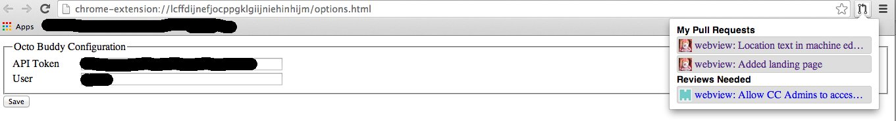

octo-buddy
==========

A chrome extension for managing Github pull requests and issues

Currently, it just shows your open pull requests and any pull requests that
you are marked as a reviewer.

I don't have this packed yet, so you will need to install it manually from the
src directory using the instructions at
http://developer.chrome.com/extensions/getstarted.html#unpacked

Once the extension is installed you will need to configure it with an (API
token)[https://help.github.com/articles/creating-an-access-token-for-command-line-use]
and your user login name.

